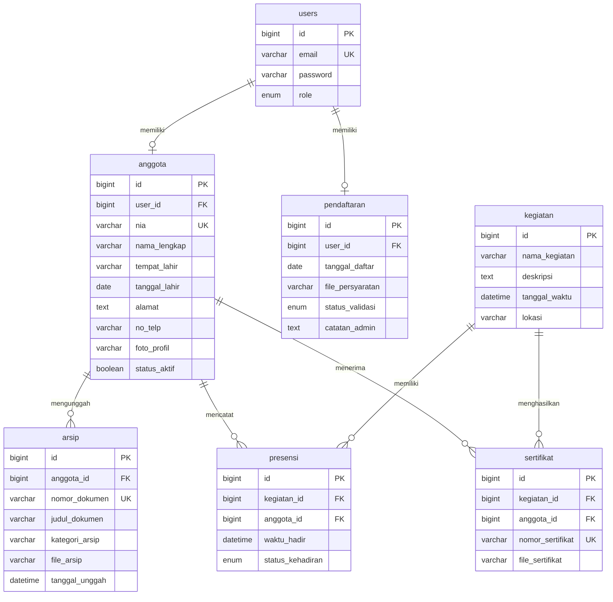
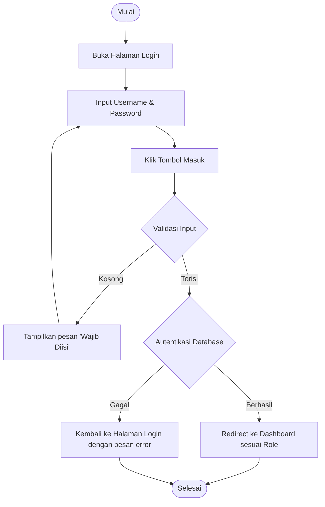
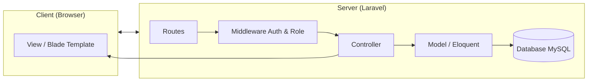

# Dokumen Rancangan Sistem (System Design)

## Sistem Informasi Manajemen Keanggotaan dan Kearsipan Berbasis Website

**Versi Dokumen:** 1.0  
**Tanggal:** 10 Mei 2026

---

## 1. Rancangan Struktur Database

Berdasarkan Class Diagram, sistem memiliki **tujuh (7) entitas utama** yang diterjemahkan menjadi tabel database berikut:

---

### 1.1 Tabel `users`

Menyimpan data autentikasi seluruh pengguna sistem.

| Kolom | Tipe Data | Constraint | Keterangan |
|-------|-----------|------------|------------|
| `id` | BIGINT UNSIGNED | PRIMARY KEY, AUTO_INCREMENT | Identifier unik |
| `email` | VARCHAR(255) | UNIQUE, NOT NULL | Email untuk login |
| `password` | VARCHAR(255) | NOT NULL | Password ter-hash |
| `role` | ENUM('admin', 'kader') | NOT NULL, DEFAULT 'kader' | Peran pengguna |
| `created_at` | TIMESTAMP | NULLABLE | Waktu pembuatan |
| `updated_at` | TIMESTAMP | NULLABLE | Waktu pembaruan |

**Method terkait:**
- `login(email, password): Boolean` — Autentikasi pengguna
- `logout(): Void` — Menghapus sesi aktif
- `checkRole(): String` — Mengecek role pengguna untuk otorisasi

---

### 1.2 Tabel `anggota`

Menyimpan data profil lengkap anggota (Kader).

| Kolom | Tipe Data | Constraint | Keterangan |
|-------|-----------|------------|------------|
| `id` | BIGINT UNSIGNED | PRIMARY KEY, AUTO_INCREMENT | Identifier unik |
| `user_id` | BIGINT UNSIGNED | FOREIGN KEY → `users.id`, UNIQUE | Relasi ke tabel users |
| `nia` | VARCHAR(50) | UNIQUE, NOT NULL | Nomor Induk Anggota |
| `nama_lengkap` | VARCHAR(255) | NOT NULL | Nama lengkap anggota |
| `tempat_lahir` | VARCHAR(100) | NOT NULL | Tempat lahir |
| `tanggal_lahir` | DATE | NOT NULL | Tanggal lahir |
| `alamat` | TEXT | NULLABLE | Alamat domisili |
| `no_telp` | VARCHAR(20) | NULLABLE | Nomor telepon |
| `foto_profil` | VARCHAR(255) | NULLABLE | Path file foto profil |
| `status_aktif` | BOOLEAN | NOT NULL, DEFAULT TRUE | Status keaktifan anggota |
| `created_at` | TIMESTAMP | NULLABLE | Waktu pembuatan |
| `updated_at` | TIMESTAMP | NULLABLE | Waktu pembaruan |

**Relasi:**
- **One-to-One** dengan tabel `users` melalui `user_id`
- **One-to-Many** dengan tabel `arsip` (satu anggota memiliki banyak arsip)
- **One-to-Many** dengan tabel `presensi` (satu anggota memiliki banyak presensi)
- **One-to-Many** dengan tabel `sertifikat` (satu anggota memiliki banyak sertifikat)
- **Many-to-Many** dengan tabel `kegiatan` (melalui tabel pivot `presensi`)

**Method terkait:**
- `createProfil(data): Anggota` — Membuat profil baru
- `updateProfil(data): Boolean` — Memperbarui data profil
- `getDetailAnggota(id): Anggota` — Mengambil detail anggota
- `generateDataKTA(): Array` — Mengambil data untuk template E-KTA

---

### 1.3 Tabel `pendaftaran`

Menyimpan data pendaftaran calon anggota yang belum tervalidasi.

| Kolom | Tipe Data | Constraint | Keterangan |
|-------|-----------|------------|------------|
| `id` | BIGINT UNSIGNED | PRIMARY KEY, AUTO_INCREMENT | Identifier unik |
| `user_id` | BIGINT UNSIGNED | FOREIGN KEY → `users.id`, NULLABLE | Relasi ke user (dibuat setelah approved) |
| `nama_lengkap` | VARCHAR(255) | NOT NULL | Nama calon anggota |
| `email` | VARCHAR(255) | NOT NULL | Email calon anggota |
| `tempat_lahir` | VARCHAR(100) | NOT NULL | Tempat lahir |
| `tanggal_lahir` | DATE | NOT NULL | Tanggal lahir |
| `no_telp` | VARCHAR(20) | NULLABLE | Nomor telepon |
| `alamat` | TEXT | NULLABLE | Alamat |
| `tanggal_daftar` | DATE | NOT NULL | Tanggal pendaftaran |
| `file_persyaratan` | VARCHAR(255) | NULLABLE | Path file persyaratan |
| `status_validasi` | ENUM('pending', 'disetujui', 'ditolak') | NOT NULL, DEFAULT 'pending' | Status validasi |
| `catatan_admin` | TEXT | NULLABLE | Catatan dari Admin |
| `created_at` | TIMESTAMP | NULLABLE | Waktu pembuatan |
| `updated_at` | TIMESTAMP | NULLABLE | Waktu pembaruan |

**Method terkait:**
- `submitPendaftaran(data): Boolean` — Menyimpan data pendaftaran baru
- `setStatusValidasi(status_validasi): Void` — Mengubah status validasi
- `getDetailPendaftaran(): Pendaftaran` — Mengambil detail pendaftaran

---

### 1.4 Tabel `kegiatan`

Menyimpan data kegiatan/agenda organisasi.

| Kolom | Tipe Data | Constraint | Keterangan |
|-------|-----------|------------|------------|
| `id` | BIGINT UNSIGNED | PRIMARY KEY, AUTO_INCREMENT | Identifier unik |
| `nama_kegiatan` | VARCHAR(255) | NOT NULL | Nama kegiatan |
| `deskripsi` | TEXT | NULLABLE | Deskripsi kegiatan |
| `tanggal_waktu` | DATETIME | NOT NULL | Tanggal dan waktu pelaksanaan |
| `lokasi` | VARCHAR(255) | NULLABLE | Lokasi kegiatan |
| `created_at` | TIMESTAMP | NULLABLE | Waktu pembuatan |
| `updated_at` | TIMESTAMP | NULLABLE | Waktu pembaruan |

**Relasi:**
- **One-to-Many** dengan tabel `presensi`
- **One-to-Many** dengan tabel `sertifikat`

**Method terkait:**
- `tambahKegiatan(data): Kegiatan` — Menambah kegiatan baru
- `editKegiatan(id, data): Boolean` — Mengedit kegiatan
- `hapusKegiatan(id): Boolean` — Menghapus kegiatan
- `getDaftarKegiatan(): Array` — Mengambil daftar semua kegiatan

---

### 1.5 Tabel `presensi`

Menyimpan data kehadiran anggota pada setiap kegiatan.

| Kolom | Tipe Data | Constraint | Keterangan |
|-------|-----------|------------|------------|
| `id` | BIGINT UNSIGNED | PRIMARY KEY, AUTO_INCREMENT | Identifier unik |
| `kegiatan_id` | BIGINT UNSIGNED | FOREIGN KEY → `kegiatan.id` | Relasi ke kegiatan |
| `anggota_id` | BIGINT UNSIGNED | FOREIGN KEY → `anggota.id` | Relasi ke anggota |
| `waktu_hadir` | DATETIME | NULLABLE | Waktu kehadiran tercatat |
| `status_kehadiran` | ENUM('hadir', 'izin', 'alfa') | NOT NULL | Status kehadiran |
| `created_at` | TIMESTAMP | NULLABLE | Waktu pembuatan |
| `updated_at` | TIMESTAMP | NULLABLE | Waktu pembaruan |

**Constraint tambahan:** UNIQUE(`kegiatan_id`, `anggota_id`) — Satu anggota hanya boleh memiliki satu record presensi per kegiatan.

**Method terkait:**
- `catatKehadiran(kegiatan_id, anggota_id): Boolean` — Mencatat kehadiran
- `updateStatusPresensi(status_kehadiran): Boolean` — Memperbarui status
- `getRiwayatKeaktifan(anggota_id): Array` — Mengambil riwayat keaktifan

---

### 1.6 Tabel `sertifikat`

Menyimpan data E-Sertifikat yang diterbitkan untuk anggota.

| Kolom | Tipe Data | Constraint | Keterangan |
|-------|-----------|------------|------------|
| `id` | BIGINT UNSIGNED | PRIMARY KEY, AUTO_INCREMENT | Identifier unik |
| `kegiatan_id` | BIGINT UNSIGNED | FOREIGN KEY → `kegiatan.id` | Relasi ke kegiatan |
| `anggota_id` | BIGINT UNSIGNED | FOREIGN KEY → `anggota.id` | Relasi ke anggota |
| `nomor_sertifikat` | VARCHAR(100) | UNIQUE, NOT NULL | Nomor unik sertifikat |
| `file_sertifikat` | VARCHAR(255) | NOT NULL | Path file sertifikat (PDF) |
| `created_at` | TIMESTAMP | NULLABLE | Waktu pembuatan |
| `updated_at` | TIMESTAMP | NULLABLE | Waktu pembaruan |

**Method terkait:**
- `generateSertifikat(kegiatan_id, anggota_id): Sertifikat` — Generate sertifikat
- `cekValiditasSertifikat(nomor_sertifikat): Boolean` — Cek validitas

---

### 1.7 Tabel `arsip`

Menyimpan data arsip dokumen organisasi.

| Kolom | Tipe Data | Constraint | Keterangan |
|-------|-----------|------------|------------|
| `id` | BIGINT UNSIGNED | PRIMARY KEY, AUTO_INCREMENT | Identifier unik |
| `anggota_id` | BIGINT UNSIGNED | FOREIGN KEY → `anggota.id` | Relasi ke anggota (pengunggah) |
| `nomor_dokumen` | VARCHAR(100) | UNIQUE, NOT NULL | Nomor dokumen arsip |
| `judul_dokumen` | VARCHAR(255) | NOT NULL | Judul dokumen |
| `kategori_arsip` | VARCHAR(100) | NOT NULL | Kategori arsip |
| `file_arsip` | VARCHAR(255) | NOT NULL | Path file arsip |
| `tanggal_unggah` | DATETIME | NOT NULL | Tanggal unggah |
| `created_at` | TIMESTAMP | NULLABLE | Waktu pembuatan |
| `updated_at` | TIMESTAMP | NULLABLE | Waktu pembaruan |

**Method terkait:**
- `unggahDokumen(data, file): Arsip` — Mengunggah dokumen baru
- `unduhDokumen(id): File` — Mengunduh dokumen
- `hapusDokumen(id): Boolean` — Menghapus dokumen
- `filterByKategori(kategori_arsip): Array` — Filter berdasarkan kategori

---

### 1.8 Diagram Relasi Antar Tabel (ERD)



---

## 2. Alur Logika Sistem (Berdasarkan Activity Diagram)

### 2.1 Alur Login

**Aktor:** Admin / Kader



**Logika Controller:**
1. Terima request POST dengan field `email` dan `password`.
2. Validasi bahwa kedua field tidak kosong (`required`).
3. Coba autentikasi menggunakan `Auth::attempt()`.
4. Jika berhasil, regenerasi session dan redirect ke dashboard berdasarkan `role`.
5. Jika gagal, redirect kembali ke form login dengan pesan error.

---

### 2.2 Alur Logout

**Aktor:** Admin / Kader

**Logika Controller:**
1. Validasi bahwa pengguna memiliki sesi login yang aktif.
2. Jika tidak ada sesi, redirect ke dashboard.
3. Jika ada sesi, tampilkan dialog konfirmasi logout.
4. Jika pengguna mengonfirmasi → hapus sesi (`Auth::logout()`, invalidate session) → redirect ke halaman utama.
5. Jika pengguna membatalkan → kembali ke dashboard.

---

### 2.3 Alur Melakukan Pendaftaran

**Aktor:** Pengunjung

**Logika Controller:**
1. Tampilkan form registrasi calon anggota.
2. Terima request POST dengan data: Nama, Tempat/Tanggal Lahir, Email, dll.
3. Validasi kelengkapan dan format data (server-side validation).
4. Jika **tidak valid** → kembalikan form dengan pesan error pada field yang salah.
5. Jika **valid** → simpan data ke tabel `pendaftaran` dengan `status_validasi = 'pending'`.
6. Redirect ke halaman sukses dengan pesan: *"Pendaftaran berhasil, silakan tunggu validasi dari Admin."*

---

### 2.4 Alur Memvalidasi Pendaftaran

**Aktor:** Admin

**Logika Controller:**
1. Query tabel `pendaftaran` dengan filter `status_validasi = 'pending'`.
2. Tampilkan daftar dalam tabel dengan tombol aksi.
3. Admin melihat detail data pendaftar.
4. **Jika disetujui:**
   - Ubah `status_validasi` menjadi `'disetujui'`.
   - Buat record baru di tabel `users` dengan role `'kader'`.
   - Buat record baru di tabel `anggota` dengan data dari pendaftaran.
5. **Jika ditolak:**
   - Ubah `status_validasi` menjadi `'ditolak'`.
   - Hapus dari antrean (atau tandai sebagai ditolak).
6. Refresh tampilan tabel dan tampilkan flash message.

---

### 2.5 Alur Mengelola Data Anggota

**Aktor:** Admin

**Logika Controller:**
1. Query tabel `anggota` (JOIN `users`) untuk mendapatkan seluruh data Kader aktif.
2. Tampilkan dalam tabel dengan opsi aksi: Tambah, Edit, Hapus.
3. **Tambah:** Tampilkan form → validasi → simpan ke `anggota` dan `users`.
4. **Edit:** Tampilkan form terisi data → validasi → update record.
5. **Hapus:** Konfirmasi → soft delete atau hapus record.
6. Setelah setiap aksi, refresh tabel dan tampilkan pesan status.

---

### 2.6 Alur Mengelola Kegiatan & Presensi

**Aktor:** Admin

**Logika Controller:**
1. Query tabel `kegiatan` dan tampilkan dalam kalender atau daftar.
2. **Buat Kegiatan Baru:** Admin mengisi form → validasi → simpan ke tabel `kegiatan`.
3. **Pencatatan Presensi:**
   - Admin memilih kegiatan yang sudah berjalan.
   - Sistem query tabel `anggota` (status aktif) dan tampilkan daftar.
   - Admin mencentang status kehadiran tiap Kader (Hadir/Izin/Alfa).
   - Jika Admin menekan "Simpan" → batch insert/update ke tabel `presensi`.
   - Jika Admin menekan "Batalkan" → tidak ada perubahan, kembali ke daftar kegiatan.

---

### 2.7 Alur Mengelola Arsip Dokumen

**Aktor:** Admin / Kader

**Logika Controller:**
1. Query tabel `arsip` dan tampilkan daftar dokumen.
2. **Unggah Dokumen:**
   - Terima file upload dari form.
   - Validasi ekstensi (PDF, DOC, DOCX, JPG, PNG, dll.) dan ukuran file (maks. sesuai konfigurasi).
   - Simpan file ke `storage/app/arsip/`.
   - Simpan metadata ke tabel `arsip`.
3. **Unduh Dokumen:**
   - Ambil path file dari database berdasarkan `id`.
   - Return response download.
4. **Hapus Dokumen:**
   - Tampilkan konfirmasi penghapusan.
   - Hapus file dari storage dan record dari database.
5. Refresh tampilan daftar arsip.

---

### 2.8 Alur Mengelola Profil

**Aktor:** Admin / Kader

**Logika Controller:**
1. Query data profil pengguna yang sedang login dari tabel `anggota`.
2. Tampilkan form yang sudah terisi data saat ini (pre-filled).
3. Terima request PUT/PATCH dengan data yang diubah.
4. Validasi data (format, kelengkapan field wajib).
5. Jika **tidak valid** → kembalikan form dengan pesan error pada field yang salah.
6. Jika **valid** → update record di tabel `anggota` → tampilkan pesan sukses.

---

### 2.9 Alur Mencetak E-KTA

**Aktor:** Kader

**Logika Controller:**
1. Query data profil Kader dari tabel `anggota` (berdasarkan user yang login).
2. Siapkan data untuk template KTA: nama, NIA, foto profil, tempat/tanggal lahir, dll.
3. Render view template E-KTA dengan data profil (preview di layar).
4. Jika Kader menekan "Cetak" atau "Unduh E-KTA":
   - Generate PDF dari template menggunakan library PDF (DomPDF/Snappy).
   - Return response download PDF.

---

### 2.10 Alur Mengelola E-Sertifikat (Admin)

**Aktor:** Admin

**Logika Controller:**
1. Query tabel `sertifikat` (JOIN `kegiatan`, `anggota`) dan tampilkan daftar.
2. Admin mengeklik "Buat Sertifikat Baru":
   - Tampilkan form dengan pilihan kegiatan dan daftar Kader (multi-select).
   - Admin memilih nama-nama Kader penerima.
   - Admin menekan "Generate".
3. Sistem memproses:
   - Loop setiap Kader yang dipilih.
   - Generate nomor sertifikat unik.
   - Gabungkan nama Kader ke dalam template desain sertifikat.
   - Simpan file PDF sertifikat ke storage.
   - Simpan record ke tabel `sertifikat`.
4. Refresh tampilan dan tampilkan pesan sukses.

---

### 2.11 Alur Mengunduh E-Sertifikat (Kader)

**Aktor:** Kader

**Logika Controller:**
1. Query tabel `sertifikat` dengan filter `anggota_id` = ID anggota yang login.
2. Tampilkan daftar sertifikat (nama kegiatan, nomor sertifikat, tanggal).
3. Kader mengeklik "Unduh" pada sertifikat tertentu.
4. Ambil file sertifikat dari storage berdasarkan `file_sertifikat`.
5. Return response download PDF.

---

### 2.12 Alur Melihat Riwayat Keaktifan

**Aktor:** Kader

**Logika Controller:**
1. Query tabel `presensi` (JOIN `kegiatan`) dengan filter `anggota_id` = ID anggota yang login.
2. Hitung statistik: total kegiatan, jumlah hadir, jumlah izin, jumlah alfa, persentase kehadiran.
3. Tampilkan data dalam dua format:
   - **Tabel riwayat:** Daftar kegiatan beserta status kehadiran.
   - **Grafik statistik:** Chart kehadiran (menggunakan Chart.js atau library serupa).

---

### 2.13 Alur Mencetak Laporan

**Aktor:** Admin

**Logika Controller:**
1. Tampilkan halaman filter laporan dengan opsi:
   - Rentang tanggal (dari — sampai).
   - Jenis laporan (Data Anggota, Kegiatan, Presensi, Arsip, dll.).
2. Terima request dengan parameter filter.
3. Query database sesuai filter yang dipilih.
4. **Jika format PDF:** Generate PDF menggunakan DomPDF/Snappy → return download.
5. **Jika format Excel:** Generate spreadsheet menggunakan Laravel Excel (Maatwebsite) → return download.

---

## 3. Arsitektur Aplikasi (MVC Pattern)



**Struktur folder utama Laravel:**

```
app/
├── Http/
│   ├── Controllers/
│   │   ├── AuthController.php
│   │   ├── DashboardController.php
│   │   ├── PendaftaranController.php
│   │   ├── AnggotaController.php
│   │   ├── KegiatanController.php
│   │   ├── PresensiController.php
│   │   ├── ArsipController.php
│   │   ├── SertifikatController.php
│   │   ├── EktaController.php
│   │   ├── RiwayatKeaktifanController.php
│   │   ├── LaporanController.php
│   │   └── ProfilController.php
│   └── Middleware/
│       ├── RoleMiddleware.php
│       └── ...
├── Models/
│   ├── User.php
│   ├── Anggota.php
│   ├── Pendaftaran.php
│   ├── Kegiatan.php
│   ├── Presensi.php
│   ├── Sertifikat.php
│   └── Arsip.php
resources/
├── views/
│   ├── layouts/
│   ├── auth/
│   ├── admin/
│   ├── kader/
│   └── public/
```

---

*Dokumen ini disusun berdasarkan analisis Class Diagram dan Activity Diagram dari rancangan sistem.*
