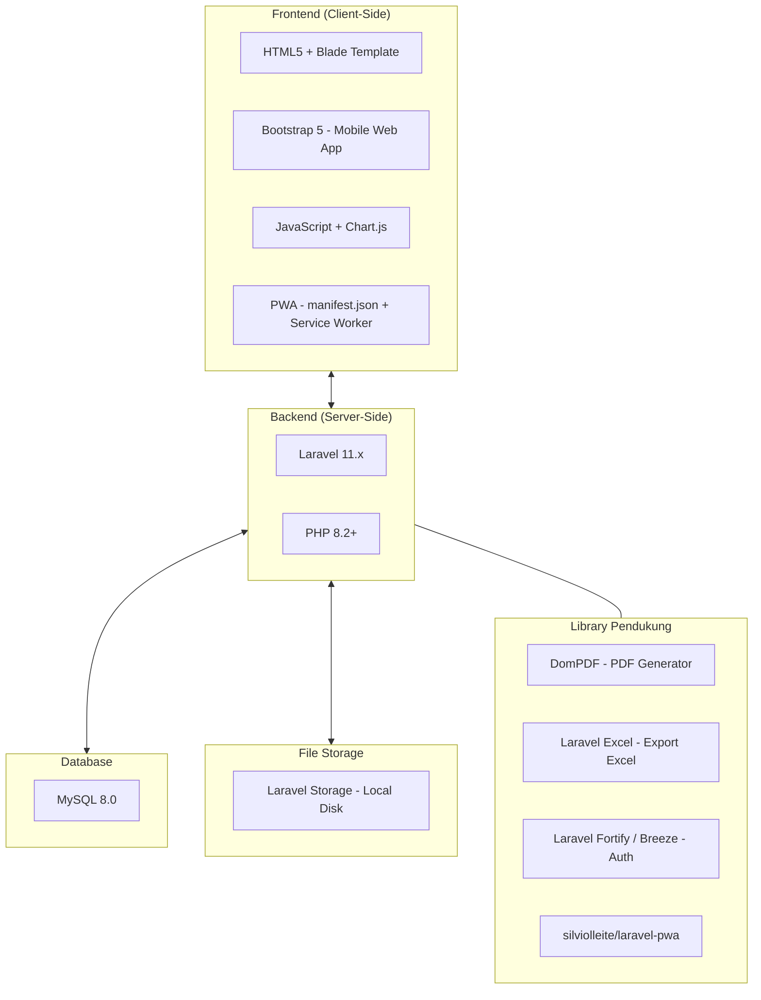

# Dokumen Spesifikasi Teknologi (Technology Specification)

## Sistem Informasi Manajemen Keanggotaan dan Kearsipan Berbasis Website

**Versi Dokumen:** 1.0  
**Tanggal:** 10 Mei 2026

---

## 1. Arsitektur Teknologi



---

## 2. Stack Teknologi Utama

### 2.1 Backend Framework

| Komponen | Teknologi | Versi | Keterangan |
|----------|-----------|-------|------------|
| **Framework** | Laravel | 11.x | Framework PHP modern dengan arsitektur MVC, Eloquent ORM, Blade templating, dan ekosistem package yang luas. |
| **Bahasa** | PHP | 8.2+ | Versi minimum yang disyaratkan oleh Laravel 11. |
| **Package Manager** | Composer | 2.x | Manajemen dependensi PHP. |

### 2.2 Frontend & UI — Pendekatan "Mobile Web App"

| Komponen | Teknologi | Versi | Keterangan |
|----------|-----------|-------|------------|
| **CSS Framework** | Bootstrap | 5.3.x | Digunakan **murni tanpa class breakpoint** (`-md`, `-lg`, `-xl`). Seluruh tampilan dirancang eksklusif untuk viewport mobile, sehingga menghasilkan pengalaman layaknya aplikasi HP native. |
| **Navigasi Utama** | Bottom Navigation Bar | — | Navigasi utama menggunakan **Bottom Navigation Bar** (`fixed-bottom`) menggantikan top navbar tradisional, sesuai pola UX aplikasi mobile modern (WhatsApp, Instagram, dll.). |
| **PWA** | Progressive Web App | — | Aplikasi dapat di-install ke Homescreen smartphone melalui `manifest.json` dan Service Worker. Dikelola menggunakan package `silviolleite/laravel-pwa`. |
| **Template Engine** | Blade | (bawaan Laravel) | Template engine bawaan Laravel untuk rendering view sisi server. |
| **Icon** | Bootstrap Icons | 1.x | Library ikon SVG yang terintegrasi dengan Bootstrap. Digunakan sebagai ikon pada Bottom Navigation Bar dan elemen UI lainnya. |
| **Chart/Grafik** | Chart.js | 4.x | Library JavaScript untuk menampilkan grafik statistik kehadiran pada fitur Riwayat Keaktifan. |
| **Build Tool** | Vite | (bawaan Laravel) | Bundler asset modern yang sudah terintegrasi di Laravel 11. |

> **Prinsip Desain UI — Mobile Web App:**
> Aplikasi ini **bukan** sekadar website responsif, melainkan dirancang sebagai **Mobile Web App** yang terasa seperti aplikasi HP native:
> - **Tanpa breakpoint CSS** — Seluruh layout dirancang khusus untuk layar mobile (≤ 576px). Tidak menggunakan class `-md`, `-lg`, atau `-xl` dari Bootstrap.
> - **Bottom Navigation Bar** — Menu utama ditempatkan di bagian bawah layar menggunakan class `fixed-bottom`, sehingga mudah dijangkau oleh ibu jari pengguna.
> - **Full-screen feel** — Konten memenuhi layar tanpa whitespace berlebih yang biasa terlihat di website desktop.
> - **Progressive Web App (PWA)** — Pengguna dapat meng-install aplikasi ke Homescreen smartphone, mendapatkan splash screen, dan ikon aplikasi sendiri layaknya aplikasi native.
> - **Touch-optimized** — Semua tombol dan elemen interaktif berukuran minimal 44x44px sesuai standar aksesibilitas mobile.
> - Pendekatan ini mempercepat pengembangan (sesuai prinsip **RAD**) karena hanya perlu mendesain satu viewport.

### 2.3 Database

| Komponen | Teknologi | Versi | Keterangan |
|----------|-----------|-------|------------|
| **RDBMS** | MySQL | 8.0+ | Database relasional yang stabil, performan, dan kompatibel penuh dengan Laravel Eloquent ORM. |
| **ORM** | Eloquent | (bawaan Laravel) | Object-Relational Mapping bawaan Laravel untuk interaksi database. |
| **Migration** | Laravel Migration | (bawaan Laravel) | Versioning skema database menggunakan migration file. |
| **Seeder** | Laravel Seeder | (bawaan Laravel) | Pengisian data awal (dummy/default) untuk pengembangan dan testing. |

### 2.4 Library & Package Pendukung

| Package | Fungsi | Instalasi |
|---------|--------|-----------|
| **barryvdh/laravel-dompdf** | Generate file PDF untuk E-KTA, E-Sertifikat, dan Laporan. | `composer require barryvdh/laravel-dompdf` |
| **maatwebsite/excel** | Export laporan ke format Excel (XLSX). | `composer require maatwebsite/excel` |
| **laravel/breeze** | Scaffolding autentikasi (login, logout, register) dengan tampilan Blade. | `composer require laravel/breeze --dev` |
| **intervention/image** | Manipulasi gambar untuk foto profil (resize, crop). | `composer require intervention/image` |
| **silviolleite/laravel-pwa** | Manajemen PWA: generate `manifest.json`, Service Worker, dan konfigurasi ikon/splash screen. | `composer require silviolleite/laravel-pwa` |
| **spatie/laravel-permission** *(opsional)* | Manajemen role & permission yang lebih granular jika dibutuhkan pengembangan lebih lanjut. | `composer require spatie/laravel-permission` |

---

## 3. Kebutuhan Server & Environment

### 3.1 Environment Pengembangan (Development)

| Komponen | Rekomendasi | Keterangan |
|----------|-------------|------------|
| **OS** | Windows 10/11, macOS, atau Linux | Sistem operasi untuk pengembangan lokal. |
| **Local Server** | Laragon / XAMPP / Herd | Paket server lokal yang mencakup PHP, MySQL, dan Apache/Nginx. **Laragon** sangat direkomendasikan untuk Windows karena ringan dan mendukung Laravel secara native. |
| **PHP** | 8.2 atau lebih tinggi | Dengan ekstensi: `BCMath`, `Ctype`, `Fileinfo`, `JSON`, `Mbstring`, `OpenSSL`, `PDO`, `Tokenizer`, `XML`, `GD/Imagick`. |
| **MySQL** | 8.0 atau lebih tinggi | Atau MariaDB 10.3+. |
| **Node.js** | 18.x atau lebih tinggi | Untuk menjalankan Vite (build tool asset frontend). |
| **npm** | 9.x atau lebih tinggi | Package manager untuk dependensi JavaScript. |
| **Composer** | 2.x | Package manager untuk dependensi PHP. |
| **Git** | 2.x | Version control system. |
| **Code Editor** | Visual Studio Code | Dengan ekstensi: PHP Intelephense, Laravel Blade Snippets, Laravel Extra Intellisense. |

### 3.2 Environment Produksi (Production)

| Komponen | Spesifikasi Minimum | Keterangan |
|----------|---------------------|------------|
| **Server** | VPS / Shared Hosting | Minimal 1 vCPU, 1 GB RAM, 20 GB Storage. |
| **Web Server** | Nginx atau Apache | Nginx lebih direkomendasikan untuk performa. |
| **PHP** | 8.2+ dengan PHP-FPM | Untuk performa optimal di production. |
| **Database** | MySQL 8.0+ | Dengan konfigurasi keamanan production. |
| **SSL** | Let's Encrypt (gratis) | HTTPS wajib untuk keamanan data pengguna. |
| **Domain** | Custom domain | Sesuai kebutuhan organisasi. |

### 3.3 Konfigurasi Laravel (.env)

```env
APP_NAME=SIM-Keanggotaan-IMM
APP_ENV=local
APP_DEBUG=true
APP_URL=http://localhost:8000

DB_CONNECTION=mysql
DB_HOST=127.0.0.1
DB_PORT=3306
DB_DATABASE=sim_keanggotaan_imm
DB_USERNAME=root
DB_PASSWORD=

FILESYSTEM_DISK=local

SESSION_DRIVER=database
SESSION_LIFETIME=120
```

---

## 4. Struktur Direktori Proyek

```
SIM-Keanggotaan-IMM/
├── app/
│   ├── Http/
│   │   ├── Controllers/         # Controller untuk setiap modul
│   │   ├── Middleware/           # Middleware autentikasi & role
│   │   └── Requests/            # Form Request Validation
│   ├── Models/                  # Eloquent Model (7 model)
│   ├── Exports/                 # Class export Excel (Maatwebsite)
│   └── Services/                # Business logic (opsional)
├── database/
│   ├── migrations/              # File migrasi database
│   ├── seeders/                 # Seeder data awal
│   └── factories/               # Factory untuk testing
├── resources/
│   ├── views/
│   │   ├── layouts/
│   │   │   └── app.blade.php    # Layout utama Mobile Web App + Bottom Nav
│   │   ├── components/
│   │   │   └── bottom-nav.blade.php  # Komponen Bottom Navigation Bar
│   │   ├── auth/                # Halaman login
│   │   ├── admin/               # View khusus Admin
│   │   │   ├── dashboard.blade.php
│   │   │   ├── anggota/
│   │   │   ├── kegiatan/
│   │   │   ├── presensi/
│   │   │   ├── pendaftaran/
│   │   │   ├── sertifikat/
│   │   │   ├── arsip/
│   │   │   └── laporan/
│   │   ├── kader/               # View khusus Kader
│   │   │   ├── dashboard.blade.php
│   │   │   ├── profil/
│   │   │   ├── ekta/
│   │   │   ├── sertifikat/
│   │   │   ├── riwayat/
│   │   │   └── arsip/
│   │   ├── public/              # View publik (pendaftaran)
│   │   └── pdf/                 # Template PDF (E-KTA, Sertifikat, Laporan)
│   ├── css/
│   └── js/
├── public/
│   ├── images/icons/            # Ikon PWA (72x72 s/d 512x512)
│   ├── manifest.json            # PWA Manifest (di-generate oleh laravel-pwa)
│   └── serviceworker.js         # Service Worker untuk PWA
├── routes/
│   └── web.php                  # Definisi routing
├── storage/
│   └── app/
│       ├── arsip/               # Penyimpanan file arsip
│       ├── sertifikat/          # Penyimpanan file sertifikat
│       ├── foto-profil/         # Penyimpanan foto profil
│       └── persyaratan/         # Penyimpanan file persyaratan pendaftaran
├── .env
├── composer.json
├── package.json
└── vite.config.js
```

---

## 5. Keamanan

| Aspek | Implementasi |
|-------|-------------|
| **Autentikasi** | Laravel Breeze dengan session-based authentication. |
| **Hashing Password** | Bcrypt (default Laravel). |
| **CSRF Protection** | Token CSRF otomatis pada setiap form (`@csrf` directive). |
| **Validasi Input** | Server-side validation menggunakan Form Request. |
| **Otorisasi Role** | Middleware custom `RoleMiddleware` untuk membatasi akses berdasarkan role. |
| **File Upload** | Validasi ekstensi dan ukuran file. File disimpan di luar direktori publik (`storage/app/`). |
| **SQL Injection** | Dicegah secara otomatis oleh Eloquent ORM dan Query Builder. |
| **XSS** | Dicegah oleh Blade template (auto-escaping `{{ }}`). |

---

*Dokumen ini disusun sebagai panduan teknis untuk implementasi sistem.*
